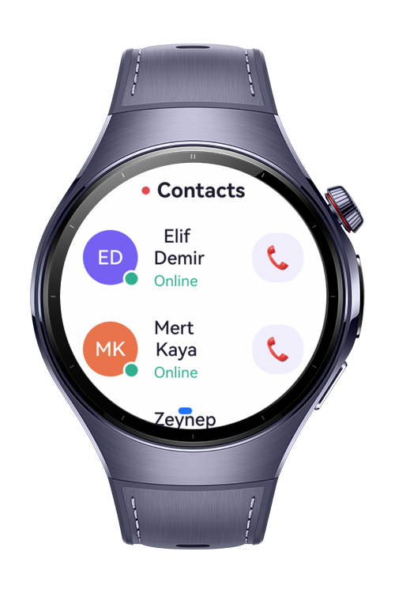
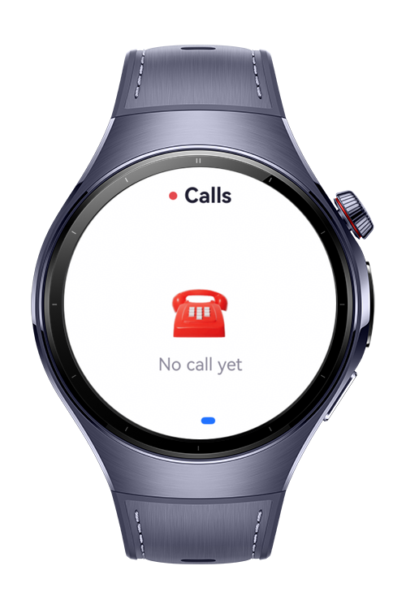
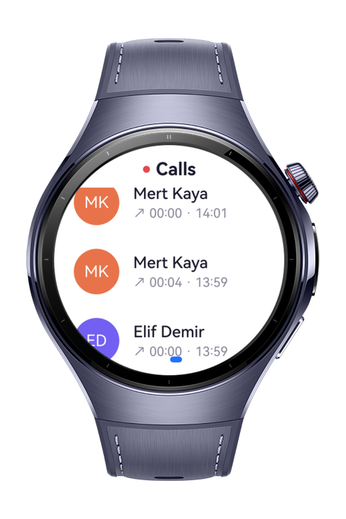
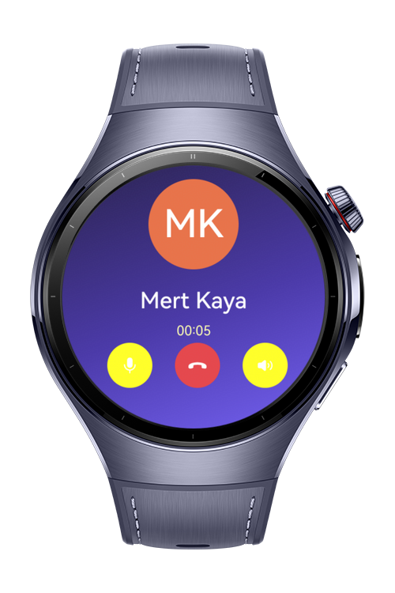

> **Note:** To access all shared projects, get information about environment setup, and view other guides, please visit [Explore-In-HMOS-Wearable Index](https://github.com/Explore-In-HMOS-Wearable/hmos-index).

# Wear Call

Wear Call is a wearable VoIP application that lets users place and receive real-time voice calls over the internet, without a SIM card or carrier network.

# Preview
<div>
  
  
  
  
</div>

# Use Cases

1. Users can browse their contact list and start a voice call by tapping on a contact.
2. Users receive incoming calls with a full-screen ringing display and can accept or reject them.
3. During an active call, users can mute the microphone, toggle the speaker, and end the call.
4. Users can review their call history, where missed calls are highlighted, and tap any entry to call back.

# Technology

## Stack

* Languages: ArkTS, ArkUI
* Frameworks: HarmonyOS 5.0.1(13)
* Tools: DevEco Studio Version (6.1.1(24))
* Libraries:
	@kit.ArkUI 
	@kit.AudioKit
    @kit.NetworkKit
    @kit.AbilityKit
    @kit.BasicServicesKit

## Required Permissions

* `ohos.permission.INTERNET`
  Required to connect to the signaling server and stream audio.
* `ohos.permission.GET_NETWORK_INFO`
  Required to monitor network availability.
* `ohos.permission.MICROPHONE`
  Required to capture the user's voice during a call.

# Directory Structure

```
entry/src/main/ets/
├───common
│       AudioEngine.ets
│       CallManager.ets
│       Config.ets
│       Permissions.ets
│       SignalingClient.ets
│
├───entryability
│       EntryAbility.ets
│
├───model
│       CallTypes.ets
│       MockData.ets
│
├───pages
│       Index.ets
│
└───view
        CallOverlay.ets
        ContactsView.ets
        RecentsView.ets

signaling-server/
        signaling.js
        package.json
        webclient.html
```

# Architecture

All call state lives in `AppStorage` and is written exclusively by `CallManager`. Views read that state through `@StorageLink` and re-render automatically, which means the UI layer has no knowledge of the networking or audio stack. Replacing the transport does not require touching any view.

Audio is streamed as raw PCM (16 kHz, mono, 16-bit) over the same WebSocket connection used for signaling. Text frames carry control messages; binary frames carry audio.

# Setup

1. Start the signaling server on a computer connected to the same local network:

```bash
cd signaling-server
npm install
node signaling.js
```

2. Set `SERVER_URL` in `common/Config.ets` to the computer's LAN address, for example `ws://192.168.1.20:8080`.
3. Set a unique `MY_ID` on each device, matching an entry in `model/MockData.ets` (`c1`, `c2`, and so on).
4. Build and run on each device.

A browser-based test client is available at `signaling-server/webclient.html` for testing with a single device. Serve it over `http://localhost` rather than opening the file directly, otherwise the browser will block microphone access.

# Constraints and Restrictions

## Supported Devices

* Huawei Watch 5

## Limitations

* Wear Call requires a physical device; microphone capture and audio routing do not work on the previewer or simulator.
* All participating devices must be on the same local network as the signaling server. NAT traversal is not implemented.
* Audio is transmitted uncompressed at roughly 256 kbit/s. This is fine over a local network, including a phone hotspot, and unreliable to route over the public internet.
* Calls end when the screen turns off, as no background task is registered.
* Users must grant microphone permission before placing or answering a call.

# License

Wear Call is distributed under the terms of the MIT License. See the [LICENSE](LICENSE) for more information.